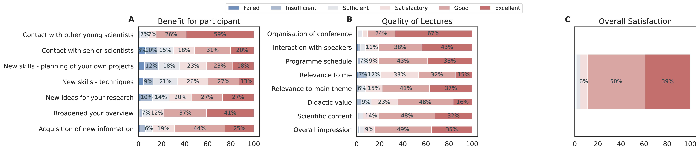
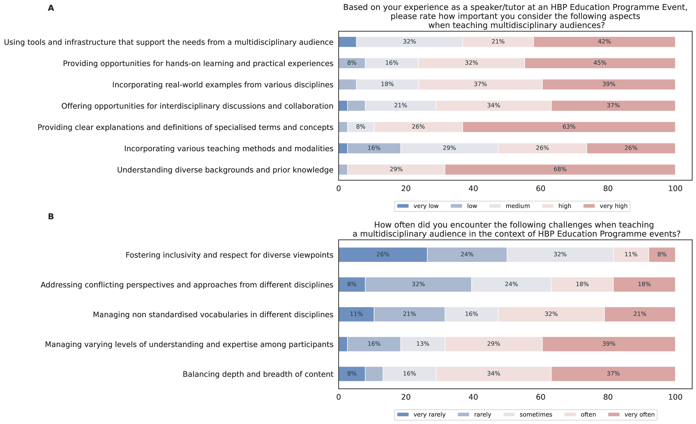
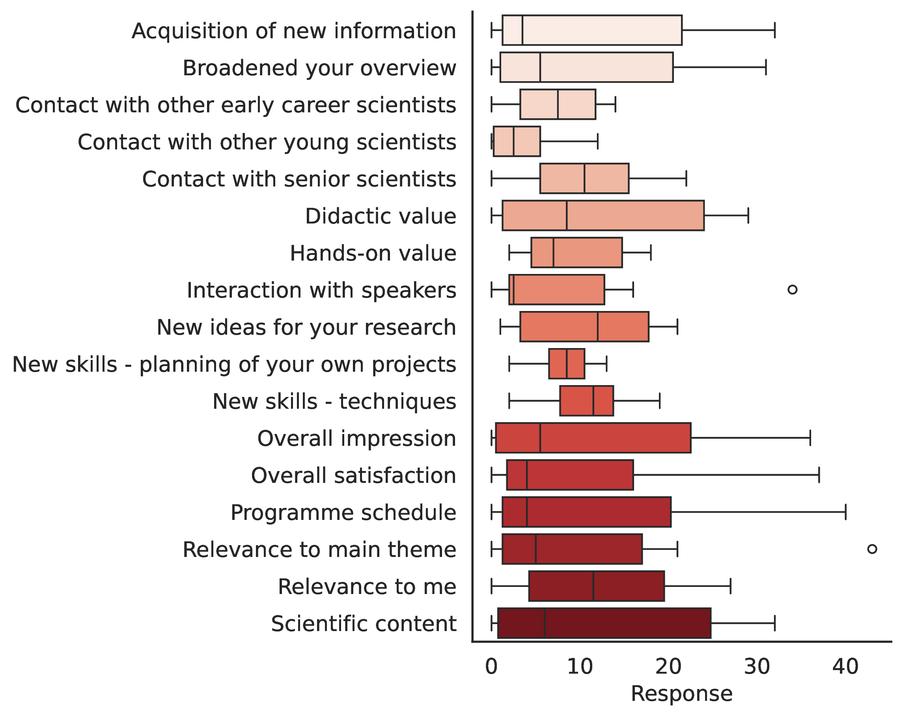

# HBP survey plots 

This repository hosts the survey plots of the paper `Interdisciplinary and collaborative training in neuroscience: Insights from the Human Brain Project Education Programme`.
The figures 8-11 in the paper are created by the Python file `plot_survey_results.py`. The plots are controlled via arguments which can be specified via the terminal (for details see [Usage](https://github.com/alperyeg/hbp_survey_plots?tab=readme-ov-file#usage)).

Figure 3 is created by the script `pi_survey_plot.py` and visualizes the survey results conducted among speakers and tutors at HBP SGA3 education events.

The script `deviation_plots.py` visualizes the figure 1 in the annex.These are the YRE survey votes deviations depicted as box plots. 

Another file is `plot_teaslides_survey.py`, which was used in an early version of the paper, and is uploaded here for completeness. It is a single figure and only shows the participants' (average) `Overall Satisfaction` pooled from all Tea and Slides online events. 

## Description 
The script `plot_survey_results.py` plots a figure depending on the input:
- If the input is `SGA1-2_summary2.xlsx`, the figure depicts the pooled average results from participants across several HBP conferences conducted in SGA1 and SGA2. It has three subplots (`Benefit for participant`, `Quality of Lectures` and `Overall Satisfaction`) and visualizes the survey outcome of several questions as horizontal stacked bars.
- If the input is `SGA3_summary.xlsx` the plots shows the outcomes for the SGA3 phase. This plot has four subfigures (`Benefit for participant`, `Quality`, `Virtual format` and `Overall Satisfaction`).
- The plot with the input `YRE Surveys_SGA1-2_summary.xlsx` displays the average survey results of the `Young Researcher Events` held in SGA1 and SGA2. The structure follows the plot as for the HBP conferences in SGA1 and SGA2.
- Similarly, the plot with the input `YRE Surveys_SGA3_summary.xlsx` shows the results of the `Young Researcher Events` in SGA3.

## Requirements
There are not many requirements to run the code, the additional, three Python packages are: 
- matplotlib
- pandas
- seaborn

Optionally to create a [Likert graph](https://github.com/nmalkin/plot-likert) (can be installed via `pip install plot-likert`): 
- plot_likert 

## Usage
### HBP Student Conference survey

The file `plot_survey_results.py` requires the input data `SGA1-2_summary2.xlsx`, `SGA3_summary.xlsx` `YRE Surveys_SGA1-2_summary.xlsx` or `YRE Surveys_SGA3_summary.xlsx`. These files are located in the main repository. 
To load one of the files and plot a figure use the argument `--filename`, e.g. `python plot_survey_results.py --filename SGA1-2_summary2.xlsx`. 
- `--filename`, requires the name of the file as a string. A path can also be supplied. If no filename is given then the script assumes the file `SGA1-2_summary2.xlsx`.
- `--total_mean`, if specified it prints out the average response rate of the participants.
- `--total_std`, if specified it prints out the standard deviation of the participants' response rate. 
- `--plot_type`, defines the type of the plot. Available are `stacked` plotting horizontal stacked histograms or `likert` for Likert graphs. If not specified the default is `stacked`. 
- `--percentage`, defines if percentages or absolute values will be printed on the bars.
- Thus, if no arguments are given, i.e. running only `python plot_survey_results.py`, the script assumes that `python plot_survey_results.py --filename SGA1-2_summary2.xlsx` is called.

### PI survey 

The script `pi_survey_plot.py` requires the input data `PI Survey_Data.xlsx` (hard-coded) and has only one argument:
- `--percentage`: Defines whether percentage or absolute value will be visualized on the bars.

### Deviation plots

The script `deviation_plots.py` requires `YRE Surveys_SGA1-2_summary.xlsx` or `YRE Surveys_SGA3_summary.xlsx` as input. This script has an additional argument `success_rate`, which plots all votes as box plots. However, the resulting plot is not added to the paper. 
- `--filename`, requires the name of the file as a string. A path can also be supplied. If no filename is given then the script assumes the file `SGA1-2_summary2.xlsx`.
- `--success_rate`, a boxplot illustrating the total success rate. This argument is optional.
- `--save`, indicates whether the plots should be saved. Default is `False`. 

For the final version of the manuscript we decided not use the plot for the tea and slides survey. The script `plot_teaslides_survey.py` follows the same command scheme as above. The file requires the input `HBPTeaandSlides_overall_satisfaction.xlsx`. 

### Figure specific commands
Below are the arguments to create the figures from the manuscript: 
- Fig.3: `pi_survey_plot.py --percentage`
- Fig.8: `python plot_survey_results.py --filename SGA1-2_summary2.xlsx --plot_type stacked --percentage`
- Fig.9: `python plot_survey_results.py --filename SGA3_summary.xlsx --percentage`
- Fig.10: `python plot_survey_results.py --filename YRE\ Surveys_SGA1-2_summary.xlsx --percentage`
- Fig.11: `python plot_survey_results.py --filename YRE\ Surveys_SGA3_summary.xlsx --percentage`
- Annex Fig.1 (top): `python deviation_plots.py --filename YRE\ Surveys_SGA1-2_summary.xlsx`
- Annex Fig.1 (bottom): `python deviation_plots.py --filename YRE\ Surveys_SGA3_summary.xlsx`
